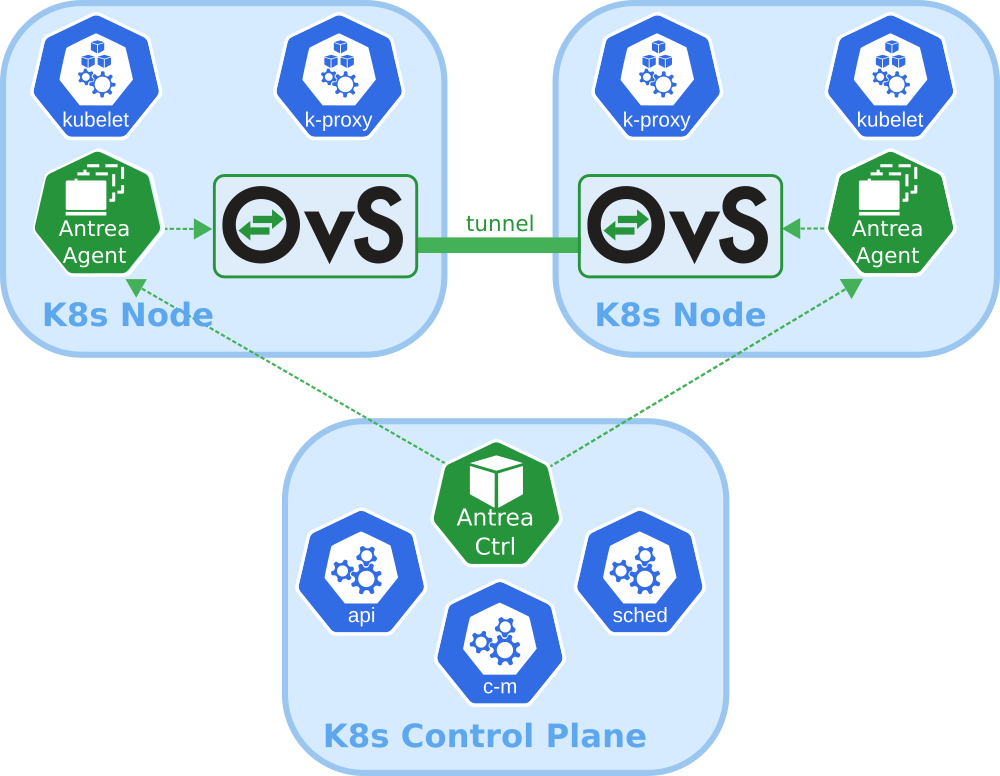

# 恭喜Antrea项目进入 CNCF Sandbox

太平洋时间5月6日，由云原生计算基金会（CNCF）技术监督委员会（TOC）投票，同意VMware开源的项目Antrea正式成为沙箱级项目（Sandbox Level Project）。

Antrea项目是一个开源的Kubernetes CNI网络插件解决方案，旨在成为Kubernetes的本地产品。
它利用Open vSwitch作为网络数据平面，Open vSwitch是一种高性能可编程虚拟交换机，同时支持Linux和Windows。
Open vSwitch使Antrea能够以高性能和高效的方式实施Kubernetes网络策略。
借助Open vSwitch的“可编程”特性， Antrea能够在Open vSwitch的基础上实现广泛的网络，安全功能和服务。

Antrea github 地址：
https://github.com/vmware-tanzu/antrea

Project Antrea is an opensource Kubernetes networking solution intended to be Kubernetes native. 
It leverages Open vSwitch as the networking data plane. 
Open vSwitch is a high-performance programmable virtual switch that supports both Linux and Windows. 
Open vSwitch enables Antrea to implement Kubernetes Network Policies in a high-performance and efficient manner. 
Thanks to the "programmable" characteristic of Open vSwitch, 
Antrea is able to implement an extensive set of networking and security features and services on top of Open vSwitch.

# 项目介绍

Antrea最初于2019年11月发布，为Kubernetes集群实现了容器网络接口（CNI）和Kubernetes NetworkPolicy。
它建立在Open vSwitch（OVS）的基础之上，OVS是为分布式多层交换性能而优化的开源技术。
由于OVS中具有高度可扩展的体系结构，所以Project Antrea迅速添加了新功能，
同时由于用户和合作伙伴社区的贡献和互操作性支持而获得了广泛的关注。

# 核心能力

Antrea 具备以下功能特点：

- Kubernetes-native: Antrea follows best practices to extend the Kubernetes APIs and provide familiar abstractions to users, while also leveraging Kubernetes libraries in its own implementation.

- Powered by Open vSwitch: Antrea relies on Open vSwitch to implement all networking functions, including Kubernetes Service load-balancing, and to enable hardware offloading in order to support the most demanding workloads.

- Run everywhere: Run Antrea in private clouds, public clouds and on bare metal, and select the appropriate traffic mode (with or without overlay) based on your infrastructure and use case.

- Windows Node support: Thanks to the portability of Open vSwitch, Antrea can use the same data plane implementation on both Linux and Windows Kubernetes Nodes.

- Comprehensive policy model: Antrea provides a comprehensive network policy model, which builds upon Kubernetes Network Policies with new features such as policy tiering, rule priorities and cluster-level policies.

- Troubleshooting and monitoring tools: Antrea comes with CLI and UI tools which provide visibility and diagnostics capabilities (packet tracing, policy analysis, flow inspection). It exposes Prometheus metrics and supports exporting network flow information which can be visualized in Kibana dashboards.

- Encryption: Encryption of inter-Node Pod traffic with IPsec tunnels when using an overlay Pod network.

- Easy deployment: Antrea is deployed by applying a single YAML manifest file.

# 架构设计

Antrea 架构如下：

Antrea is designed to be Kubernetes-centric and Kubernetes-native. It focuses on and is optimized for networking and security of a Kubernetes cluster. Its implementation leverages Kubernetes and Kubernetes native solutions as much as possible.

Antrea leverages Open vSwitch as the networking data plane. Open vSwitch is a high-performance programmable virtual switch that supports both Linux and Windows. Open vSwitch enables Antrea to implement Kubernetes Network Policies in a high-performance and efficient manner. Thanks to the "programmable" characteristic of Open vSwitch, Antrea is able to implement an extensive set of networking and security features and services on top of Open vSwitch.

Some information in this document and in particular when it comes to the Antrea Agent is specific to running Antrea on Linux Nodes. For information about how Antrea is run on Windows Nodes, please refer to the Windows design document.

Antrea 的部署也非常简单，部署Kubernetes集群之后，通过一键执行
`kubectl apply -f https://raw.githubusercontent.com/vmware-tanzu/antrea/main/build/yamls/antrea.yml`
即可安装Andrea的最新版本，也可以指定版本安装：
`kubectl apply -f https://github.com/vmware-tanzu/antrea/releases/download/<TAG>/antrea.yml`,
具体可以查看：https://github.com/vmware-tanzu/antrea/blob/main/docs/getting-started.md。

# 客户案例

# 未来规划

Antrea未来的规划包括

通过最新发布的 1.0 版本，你可以测试最新的特性，并设想下一个版本的新可能性。

欢迎大家加入社区，积极贡献代码，使用和测试，共同推动Kubernetes容器网络和网络策略发展，讨论更多新特性的规划，
构建未来更高效的Kubernetes CNI和Network Policy。

# CNCF

CNCF (Cloud Native Computing Foundation)成立于2015年12月，隶属于Linux Foundation，是非营利性组织。

CNCF（云原生计算基金会）致力于培育和维护一个厂商中立的开源生态系统，来推广云原生技术。
通过将最前沿的模式民主化，让这些创新为大众所用。

# refs

https://www.cncf.io/sandbox-projects/

https://www.cncf.io/online-programs/securing-and-accelerating-the-kubernetes-cni-data-plane-with-project-antrea-and-nvidia-mellanox-connectx-smartnics/

